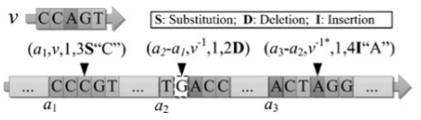
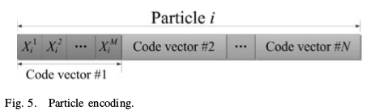
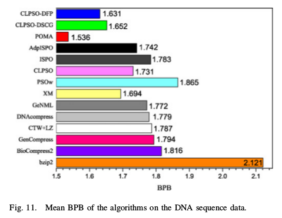

class: center, middle

# CUFE-Masters SBE628

## Data Compression (1)

Instructor: **Muhammad Islam**

Presented by Mohamed AbdAllah

---

class: center, middle
# DNA Sequence Compression Using Adaptive Particle Swarm Optimization-Based Memetic Algorithm

Zexuan Zhu, Jiarui Zhou, Zhen Ji, Member, IEEE, and Yu-Hui Shi, Senior Member, IEEE

---

# Agenda

1. Introduction

--

2. Repeat Patterns and ARV

--

3. POMA and the optimization problem

--

4. Results and Discussion

---

# Introduction

DNA sequences consist of a series of symbols representing
the nucleotide bases: Adenine (**A**), Thymine (**T**), Guanine (**G**),
and Cytosine (**C**)

--

General purpose algorithms shows less performance for compressing DNA sequences, as they do not consider the intrinsic *Biological* properties in DNA

--

Most of the existing DNA-specific methods use for repeated *subsequences* coding scheme or with short pointers to an entry in
a reference dictionary/codebook. 

---

# The new approach

This paper focuses on substitutional methods in vertical
mode:

--

1. We first propose a novel approximate repeat vector (ARV) model to represent the four repeat patterns *direct*,      *mirror*, *pairing*, and *inverted*.

--

    The design of ARV codebook is an optimization problem:

    1. Maximize the exact cover rate
    2. Minimize the base distance

--
2. To solve this optimization problem, we introduce a novel adaptive particle swarm optimization-
based memetic algorithm (POMA).

--

We are going to focus on the AVR and the first part of POMA

---

# Repeat Patterns and ARV

The DNA repeat patterns

1. Direct repeat
2. Mirror repeat
3. Pairing repeat
4. Inverted repeat

---

The ARV models

1. Direct repeat$\rightarrow\ v$
2. Mirror repeat$\rightarrow\ v^{-1}$
3. Pairing repeat$\rightarrow\ v^*$
4. Inverted repeat$\rightarrow\ v^{-1*}$

---

# The repeat vector representation

Given a codebook of N reference code vectors with each having M bases:

--
$\lceil \log_2 \mathrm{max}(ra) \rceil$

--
+$\lceil \log_2 N \rceil$

--
+$\lceil \log_2 \mathrm{max}(ed) \rceil$

--
+
2-bits for repeat pattern

--

Both $\lceil \log_2 \mathrm{max}(ra) \rceil$ & $\lceil \log_2 \mathrm{max}(ed) \rceil$
must be applied to every single repeated fragment

--

+ **Relative address**

$\lceil \log_2 \mathrm{max}(ra) \rceil\rightarrow$
$\lceil \log_2 M \rceil$

--

+ **Edit distance**

$\lceil \log_2 \mathrm{max}(ed) \rceil\rightarrow$
$\lceil \log_2 M \rceil$

--

+ **Base Variation**

$\lceil \log_2 M \rceil$ + 2-bits for edit-type + 2-bits for edit-value

---
background-position: right
background-image: url(./images/flwchrt-POMA.png)
# POMA (particle swarm optimization-based memetic algorithm)

.left[
Basically this part is an optimization problem

+ Particle Encoding and Fitness Function

+ Global search & local search

    The optimization part
]

---

# Particle Encoding

.top[]

$$ \Theta_i ^j =
  \begin{cases}
    A  & \quad \text{if } -\hat{X}\leq X_i^j < -\hat{X}/2  \\\\
    G  & \quad \text{if } -\hat{X}/2\leq X_i^j < 0  \\\\
    C  & \quad \text{if } 0\leq X_i^j < \hat{X}/2  \\\\
    T  & \quad \text{if } \hat{X}/2\leq X_i^j < \hat{X}
  \end{cases} $$

---

# Fitness Function

$$ \mathrm{Fitness}(X) = \frac{\\# bases}{\\# bits} $$

$\\# bits = 2MN$

--
+$2(\\#base-Covers(X\rightarrow \Theta))$

--
+$\eta(Repeats(X\rightarrow \Theta))$

--
+$\zeta(Variations(X\rightarrow \Theta))$

--

$\eta \Rightarrow$
$\lceil \log_2 \mathrm{max}(ra) \rceil + \lceil \log_2 N \rceil + \lceil \log_2 \mathrm{max}(ed) \rceil + 2$

--

$\zeta \Rightarrow$
$\lceil \log_2 M \rceil + 4$

--

They used fast fuzzy string searching algorithm
AGREP, to identify the approximate repeats of
ARVs in all concerned sequences, so that $Covers(X\rightarrow \Theta)$,
$Repeats(X\rightarrow \Theta)$, and $Variations(X\rightarrow \Theta)$ can be determined.

---

# Results

