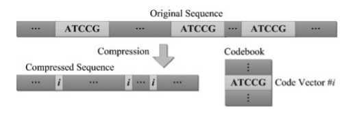
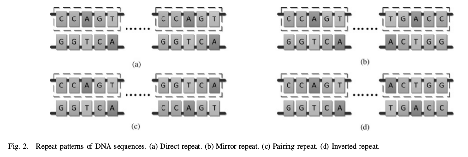

class: center, middle

# CUFE-Masters SBE628

## Data Compression (1)

Instructor: **Muhammad Islam**

Presented by Mohamed AbdAllah

---

class: center, middle
# DNA Sequence Compression Using Adaptive Particle Swarm Optimization-Based Memetic Algorithm

Zexuan Zhu, Jiarui Zhou, Zhen Ji, Member, IEEE, and Yu-Hui Shi, Senior Member, IEEE

---

# Agenda

1. Introduction

--
2. Repeat Patterns and ARV

--
3. POMA

--

    1. Particle Encoding and Fitness Function

--
    2. Global Search

--
4. Results

--
5. Discussion and Future Work

--
6. Conclusion

---

# Introduction

DNA sequences consist of a series of symbols representing
the nucleotide bases: Adenine (**A**), Thymine (**T**), Guanine (**G**),
and Cytosine (**C**)

--

General purpose algorithms shows less performance for compressing DNA sequences, as they do not consider the intrinsic *Biological* properties in DNA

--

Most of the existing DNA-specific methods use for repeated *subsequences* coding scheme or with short pointers to an entry in
a reference dictionary/codebook. 

---

# The new approach

This paper focuses on substitutional methods in vertical
mode:

--

1. We first propose a novel approximate repeat vector (ARV) model to represent the four repeat patterns *direct*,      *mirror*, *pairing*, and *inverted*.

--

    The design of ARV codebook is an optimization problem:

    1. Maximize the exact cover rate
    2. Minimize the base distance

--
2. To solve this optimization problem, we introduce a novel adaptive particle swarm optimization-
based memetic algorithm (POMA).

--

We will explain these new approaches through the following

---

# Repeat Patterns and ARV

The DNA repeat patterns

1. Direct repeat
2. Mirror repeat
3. Pairing repeat
4. Inverted repeat

---

 